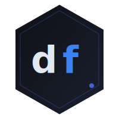

<p align="center">
  
</p>

<h1 align="center">dfiles</h1>

<p align="center"><em>dotfiles · packages · AI tools · managed as one</em></p>

---

**dfiles** is a declarative, AI-first developer environment manager. It tracks your
dotfiles, Homebrew packages, language runtimes, and Claude Code skills in a single
git repository, and reproduces your complete development environment on any machine
from a single command.

```sh
dfiles init gh:you/my-env --apply  # new machine: full environment in minutes
dfiles apply                        # sync changes to this machine
dfiles status                       # see what's drifted
```

---

## Why I built this

I was already managing dotfiles with chezmoi and liked it fine — until I started using
AI coding assistants seriously.

**The problem isn't the dotfiles. It's everything else that makes you productive.**

When I set up a new machine today, I need my `.zshrc` and `.gitconfig` — but I also
need the right Claude Code skills installed, the right MCP servers wired up, my
Homebrew packages, my mise runtimes, my editor config fetched from GitHub. chezmoi
handles files. It has no concept of skills, commands, or AI tooling. So I was
running half a dozen tools and still doing a bunch of manual steps after.

There's a bootstrap paradox baked into every dotfile manager: to be productive on a
new machine you need your tools, but to get your tools you need to already be
somewhat set up. The ideal is one command that takes you from fresh OS to fully
working environment — `dfiles init gh:me/my-env --apply`. That's the bar I set for this.

The other thing that bothered me: when I run `brew install` or install a new Claude
skill, my dotfiles repo doesn't know. It drifts. I have to manually update my
Brewfile and commit it. With dfiles, `dfiles brew install ripgrep` runs the install
*and* adds it to your Brewfile in one step. The repo stays in sync with reality.

Finally, I wanted the ability to share a complete, versioned AI development environment
as a package — the way npm packages share a JavaScript project. Something where someone
can say "here's my Claude Code setup, including all the skills and configs I use daily"
and others can install the whole thing with one command. That's the long-term vision
for dfiles: the package registry for AI developer environments.

So: I built dfiles because the AI era needs a tool that treats AI configurations as
first-class citizens alongside dotfiles and packages. Nothing else does all three
in one place.

---

## What it manages

| Thing | How |
|-------|-----|
| Dotfiles | Copied (or symlinked) to their destinations; flags encoded in the source filename |
| Homebrew packages | Brewfile-driven; `dfiles brew install` keeps Brewfiles in sync |
| Language runtimes | Via [mise](https://mise.jdx.dev/) config files |
| Claude Code skills | Declared in `ai/skills.toml`, fetched from `gh:owner/repo[@ref]`, pinned in `dfiles.lock` |
| Secrets | Read from 1Password at apply time via `{{ op(path="...") }}` templates |
| External git repos | Cloned/pulled to a destination directory via `extdir_` markers |

---

## Quick start

### New repo

```sh
dfiles init
dfiles add ~/.zshrc
dfiles add ~/.gitconfig
dfiles apply
```

### New machine

```sh
# Install dfiles:
curl -fsSL https://raw.githubusercontent.com/johnstegeman/dfiles/main/install.sh | sh

# Clone and apply your environment:
dfiles init gh:you/my-env --apply
```

### Importing from chezmoi

```sh
dfiles import --from chezmoi          # auto-detects chezmoi source dir
dfiles import --from chezmoi --dry-run
```

Converts `dot_` prefixes, `private_`, `executable_`, `symlink_` entries, and
`.tmpl` Go templates (converted to Tera syntax). See [`docs/guide.md`](docs/guide.md)
for what's imported and what's skipped.

---

## Key commands

```sh
dfiles init                    # initialize a new dfiles repo
dfiles add ~/.zshrc            # start tracking a file
dfiles remove ~/.zshrc         # stop tracking a file (live file untouched)
dfiles apply                   # deploy tracked files to this machine
dfiles apply --dry-run         # preview without writing anything
dfiles apply --dest ~/staging  # apply to a staging directory (for testing)
dfiles status                  # show drift between source and live files
dfiles diff                    # show file-level diff between source and live
dfiles brew install <formula>  # brew install + update Brewfile
dfiles brew uninstall <formula># brew uninstall + remove from Brewfile
dfiles import --from chezmoi   # migrate from chezmoi
dfiles init gh:you/env --apply # new machine: clone and apply in one command
```

See [`docs/COMMANDS.md`](docs/COMMANDS.md) for the full command reference.

---

## How files are tracked

dfiles uses **magic-name encoding** — all file metadata lives in the source filename
itself, with no separate TOML registry. The same encoding chezmoi uses, so migrating
is straightforward.

```
source/dot_zshrc                       →  ~/.zshrc
source/dot_config/git/config           →  ~/.config/git/config
source/private_dot_ssh/id_rsa          →  ~/.ssh/id_rsa          (chmod 0600)
source/executable_dot_local/bin/foo    →  ~/.local/bin/foo        (chmod 0755)
source/symlink_vscode_settings.json    →  ~/vscode_settings.json  (symlink)
source/dot_gitconfig.tmpl              →  ~/.gitconfig            (Tera template)
```

| Prefix/suffix | Meaning |
|---------------|---------|
| `dot_` | Replace with `.` |
| `private_` | chmod 0600 for files, 0700 for directories |
| `executable_` | chmod 0755 |
| `symlink_` | Create a symlink instead of copying |
| `extdir_` | Clone a remote git repo into this directory on apply |
| `.tmpl` suffix | Render through the Tera template engine before writing |

---

## AI skills

Skills are declared in `ai/skills.toml` and deployed to the appropriate platform
directories (`~/.claude/skills/`, etc.) by `dfiles apply`.

```toml
# ai/skills.toml

[[skill]]
name     = "pdf-processing"
source   = "gh:anthropics/skills/pdf-processing@v1.0"
platforms = "all"

[[skill]]
name     = "my-commands"
source   = "gh:me/my-commands@main"
platforms = ["claude-code"]
```

Fetched skills are pinned by SHA in `dfiles.lock` — a mismatch between the fetched
content and the recorded SHA is treated as an error (supply chain protection). Use
`dfiles ai update` to accept an intentional upgrade.

```sh
dfiles ai discover          # detect installed AI platforms
dfiles ai add gh:owner/repo # add a skill declaration to ai/skills.toml
dfiles ai fetch             # download skills to cache without deploying
dfiles ai update            # re-fetch + update lock SHAs
```

---

## Module and profile config

Modules control **packages and mise** — not files. Files are tracked entirely through
their encoded filenames in `source/`.

```toml
# modules/shell.toml

[homebrew]
brewfile = "brew/Brewfile.shell"

[mise]
config = "source/mise.toml"
```

Profiles control which modules are active on a given machine:

```toml
# dfiles.toml

[profile.default]
modules = ["shell", "git", "packages"]

[profile.work]
extends = "default"
modules = ["secrets"]       # work profile = default + secrets

[profile.minimal]
modules = ["shell"]
```

---

## Repo layout

```
~/dfiles/
├── dfiles.toml          # profiles — which modules each profile activates
├── dfiles.lock          # pinned SHA for every fetched GitHub source
│
├── source/              # dotfiles with magic-name encoded filenames
│   ├── dot_zshrc
│   ├── dot_gitconfig.tmpl          # .tmpl → rendered by Tera before writing
│   ├── private_dot_ssh/
│   │   └── id_rsa                  # private_ → chmod 0600
│   └── dot_config/
│       ├── git/config
│       └── extdir_nvim             # extdir_ → git clone into ~/.config/nvim
│
├── ai/                  # AI skill declarations
│   ├── skills.toml                 # [[skill]] entries
│   └── platforms.toml             # active AI platforms
│
├── brew/                # Homebrew Brewfiles
│   ├── Brewfile                    # master
│   └── Brewfile.shell              # module-specific
│
└── modules/             # per-module package config
    ├── shell.toml
    ├── git.toml
    └── packages.toml
```

---

## Documentation

- **[User guide](docs/guide.md)** — full reference: modules, profiles, templates,
  1Password, Brewfiles, externals, AI skills, bootstrapping, importing
- **[Command reference](docs/COMMANDS.md)** — every flag for every command

---

## Security

- **Supply chain protection** — `dfiles.lock` pins the SHA of every fetched skill.
  A mismatch between the live fetch and the recorded SHA is an error; you must run
  `dfiles ai update` to explicitly accept changed content.
- **No telemetry by default** — telemetry is off unless you enable it in `dfiles.toml`
  (`[telemetry] enabled = true`) or set `DFILES_TELEMETRY=1`. When enabled, events
  are written locally to `~/.dfiles/telemetry.jsonl` — nothing leaves your machine.

---

## License

MIT
